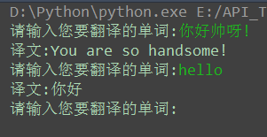

各大翻译网站API集合
===========================
   

|Author|:sunglasses:Henryhaohao:sunglasses:|
|---|---
|Email|:hearts:1073064953@qq.com:hearts:

    
****
## :dolphin:声明
### 软件均仅用于学习交流，请勿用于任何商业用途！感谢大家！
## :dolphin:介绍
### 该项目为目前常见的八个翻译网站的API
### 如果大家有别的想要添加的音乐平台，欢迎大家来Fork and Pull！  
|翻译平台|网址链接|
|----|-----|
|百度翻译|https://fanyi.baidu.com/|
|谷歌翻译|https://translate.google.cn/|
|有道翻译|http://fanyi.youdao.com/|
|360翻译|http://fanyi.so.com/|
|人人翻译|http://www.91dub.com/|
|Bing必应翻译|http://cn.bing.com/translator/|
|CNKI翻译|http://dict.cnki.net/|
|金山词霸翻译|http://www.iciba.com/|
## :dolphin:运行环境
Version: Python3
## :dolphin:安装依赖库
```
pip3 install -r requirements.txt
```
## :dolphin:运行截图



